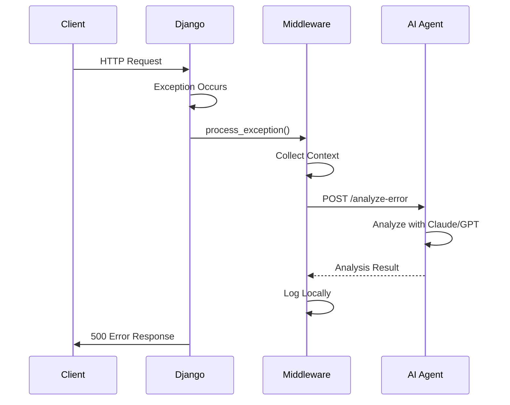

# Django AI Agent Exception Middleware

A production-ready Django middleware that automatically captures unhandled exceptions and sends them to an external AI agent service for intelligent error analysis and orchestration.

## Features

✅ **Automatic Exception Capture** - Catches all unhandled 500 errors  
✅ **Structured Context Collection** - Request path, method, user info, stack traces  
✅ **AI Agent Integration** - Sends data to external AI service (Anthropic Claude, OpenAI, etc.)  
✅ **Production-Safe** - Works with `DEBUG = False`, never breaks your app  
✅ **Async Support** - Non-blocking background processing option  
✅ **Zero Configuration Required** - Works out of the box with sensible defaults  
✅ **Comprehensive Logging** - Local logging even if AI service is down  

## Quick Start

### 1. Install Dependencies

```bash
pip install Django>=4.2 requests>=2.31.0 python-dotenv
```

### 2. Copy Files to Your Project

```
your_django_project/
├── config/
│   └── middleware/
│       ├── __init__.py
│       └── exception_middleware.py  ← Copy this file here
```

### 3. Configure Settings

Add to your `settings.py`:

```python
# Add middleware (must be LAST in the list)
MIDDLEWARE = [
    # ... other middleware ...
    'config.middleware.exception_middleware.AsyncAIAgentExceptionMiddleware',
]

# Configure AI agent service
AI_AGENT_ENABLED = True
AI_AGENT_ENDPOINT = 'http://localhost:8001/api/v1/analyze-error'
AI_AGENT_API_KEY = 'your-api-key'  # Optional
AI_AGENT_TIMEOUT = 5
```

### 4. Set Environment Variables

Create `.env` file:

```bash
AI_AGENT_ENABLED=true
AI_AGENT_ENDPOINT=http://localhost:8001/api/v1/analyze-error
AI_AGENT_API_KEY=your-secret-key
```

### 5. Done! 🎉

The middleware now automatically captures and sends all exceptions to your AI agent service.

## Files Included

| File | Description |
|------|-------------|
| [`exception_middleware.py`](exception_middleware.py) | Main middleware implementation (283 lines) |
| [`MIDDLEWARE_SETUP.md`](MIDDLEWARE_SETUP.md) | Complete setup guide with examples |
| [`example_settings.py`](example_settings.py) | Full Django settings.py example |
| [`.env.example`](env.example) | Environment variables template |
| [`README.md`](README.md) | This file |

## How It Works



## Exception Data Format

The middleware sends this JSON structure to your AI agent:

```json
{
  "timestamp": "2024-01-31T12:00:00.000000",
  "environment": "production",
  "request": {
    "path": "/api/v1/users/",
    "method": "POST",
    "content_type": "application/json",
    "query_params": {},
    "remote_addr": "192.168.1.100",
    "user_agent": "Mozilla/5.0..."
  },
  "request_body": "{\"username\": \"john\"}",
  "user": {
    "authenticated": true,
    "id": 123,
    "username": "john_doe",
    "email": "john@example.com"
  },
  "exception": {
    "type": "ValueError",
    "message": "Invalid user data",
    "module": "builtins",
    "traceback": "Traceback (most recent call last):\n...",
    "traceback_list": ["  File ...", "  File ..."]
  },
  "server": {
    "hostname": "web-server-01",
    "version": "1.0.0"
  }
}
```

## Configuration Options

| Setting | Default | Description |
|---------|---------|-------------|
| `AI_AGENT_ENABLED` | `True` | Enable/disable AI agent integration |
| `AI_AGENT_ENDPOINT` | Required | URL of your AI agent service |
| `AI_AGENT_API_KEY` | `None` | API key for authentication (optional) |
| `AI_AGENT_TIMEOUT` | `5` | Request timeout in seconds |
| `AI_AGENT_MAX_BODY_SIZE` | `10000` | Max request body size to send (bytes) |
| `HOSTNAME` | `'unknown'` | Server identifier |
| `VERSION` | `'1.0.0'` | Application version |

## Middleware Variants

### Synchronous (Simple)
```python
'config.middleware.exception_middleware.AIAgentExceptionMiddleware'
```
- Blocks until AI service responds
- Good for development
- Simpler to debug

### Asynchronous (Recommended)
```python
'config.middleware.exception_middleware.AsyncAIAgentExceptionMiddleware'
```
- Non-blocking background processing
- Better for production
- No performance impact

## Testing

Create a test endpoint:

```python
# urls.py
def test_exception(request):
    raise ValueError("Test exception for AI agent")

urlpatterns = [
    path('test-exception/', test_exception),
]
```

Visit `http://localhost:8000/test-exception/` to trigger an exception.

## Production Checklist

- [ ] Use `AsyncAIAgentExceptionMiddleware` for async processing
- [ ] Set `AI_AGENT_TIMEOUT` to 3-5 seconds
- [ ] Configure proper logging (see `example_settings.py`)
- [ ] Store `AI_AGENT_API_KEY` in environment variables
- [ ] Monitor middleware performance
- [ ] Set up alerts for AI service downtime
- [ ] Review sensitive data in request bodies

## AI Agent Service Example

Your AI agent service should accept POST requests:

```python
# FastAPI example
from fastapi import FastAPI
from pydantic import BaseModel

app = FastAPI()

class ExceptionData(BaseModel):
    timestamp: str
    environment: str
    request: dict
    user: dict
    exception: dict
    server: dict

@app.post("/api/v1/analyze-error")
async def analyze_error(data: ExceptionData):
    # Analyze with Claude/GPT
    analysis = await analyze_with_ai(data)
    
    # Store in database
    await store_exception(data, analysis)
    
    # Send alerts if critical
    if analysis.get('severity') == 'critical':
        await send_alert(data)
    
    return {"status": "received", "analysis": analysis}
```

## Troubleshooting

### Middleware Not Working
1. Check middleware is in `MIDDLEWARE` list
2. Ensure it's placed **LAST** in the list
3. Verify `AI_AGENT_ENABLED = True`
4. Check logs for initialization messages

### AI Service Not Receiving Data
1. Verify `AI_AGENT_ENDPOINT` is correct
2. Test endpoint: `curl -X POST $AI_AGENT_ENDPOINT`
3. Check API key if required
4. Review AI service logs

### Performance Issues
1. Switch to `AsyncAIAgentExceptionMiddleware`
2. Reduce `AI_AGENT_TIMEOUT`
3. Monitor execution time in logs

## Advanced Usage

### With Celery

For high-traffic applications:

```python
from celery import shared_task

@shared_task
def send_exception_to_agent(exception_data):
    requests.post(settings.AI_AGENT_ENDPOINT, json=exception_data)

class CeleryAIAgentExceptionMiddleware(AIAgentExceptionMiddleware):
    def _send_to_agent_service(self, exception_data):
        send_exception_to_agent.delay(exception_data)
```

### Custom Context

Extend the middleware to add custom context:

```python
class CustomAIAgentExceptionMiddleware(AsyncAIAgentExceptionMiddleware):
    def _collect_exception_context(self, request, exception):
        context = super()._collect_exception_context(request, exception)
        
        # Add custom fields
        context['custom'] = {
            'tenant_id': getattr(request, 'tenant_id', None),
            'feature_flags': get_feature_flags(request),
        }
        
        return context
```

## Security Considerations

⚠️ **Sensitive Data**: Request bodies may contain passwords, tokens, etc.  
⚠️ **API Keys**: Always use environment variables  
⚠️ **Rate Limiting**: Implement on AI agent service  
⚠️ **Data Retention**: Set appropriate retention policies  

## Requirements

- Python 3.8+
- Django 4.2+
- requests 2.31.0+
- python-dotenv (optional)

## License

This middleware is provided as-is for use in your Django projects.

## Support

For detailed setup instructions, see [`MIDDLEWARE_SETUP.md`](MIDDLEWARE_SETUP.md)

For complete settings example, see [`example_settings.py`](example_settings.py)

---

**Built for hackathons, ready for production** 🚀